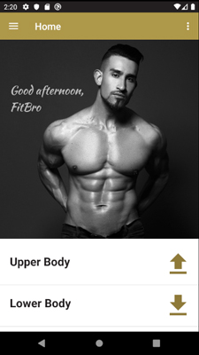
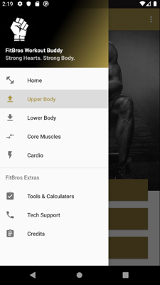
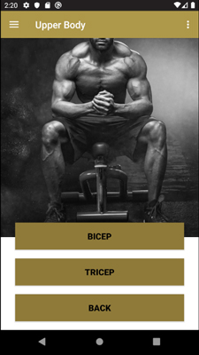

# FitBros App

Fitness app to provide workout options to optimize flow of gym experience. This app was designed to help users quickly select workouts in a gym or fitness center based on the availability of equipment.

## Getting Started

The following instructions will get a copy of the FitBros App running on your device.

### Prerequisites

Designed for an Android device with a minimum target API level of 23 (Codename: Marshmallow, Version 6.0).

### Settings

Customizations provided to the user from the menu (3 vertical dots button) at the upper right of the app are:

* Name
* Language
  * English (default)
  * Spanish
* Measurement
  * Imperial (default)
  * Metric

### Permissions

In order for full functionality, the user will need to accept a request for permission to send a SMS to tech support when the user initiates contact.

## Running the App

### General Workout Categories

The user can select exercises from 4 workout categories:

* Upper Body
* Lower Body
* Core Muscles, and
* Cardio.

These selections are available from the Home screen in a ListView, as well as the side Navigation Drawer. Of note, glutes are included in Core Muscles.

*Figure 1. Home Screen*

*Figure 2. Navigation Drawer*

### Target Workout

Within each category, the user can select from 3 targets. For example, the category Upper Body provides options for 3 target muscle groups: Bicep, Tricep, and Back.

*Figure 3. Muscle Groups*

### Exercise options

When a target button is selected, the user is provided with a RecyclerView of exercise options.

## Tools & Calculators

The user can select exercises from 4 tools:

* Set workout alarm
* Tweet your workout
* Find a gym, and
* Fit tips.

A ViewPager provides the user the option to swipe left or right to navigate from these tools to 2 calculators.

### RFM Calculator

TODO 1

### BMI Calculator

TODO 2

## Built With

* Android Studio 3.5
* Adobe Photoshop CC 2019

## Authors

* Hasan Muslemani
* Cordelle Neufeld

## Acknowledgments

Please refer to the credits in the app for a full list of acknowledgments.
